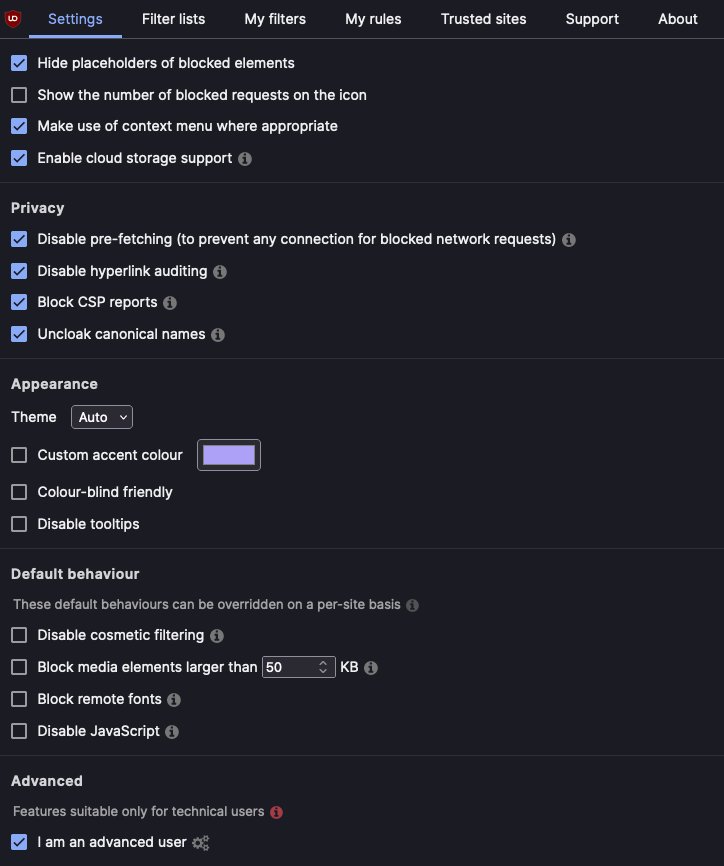
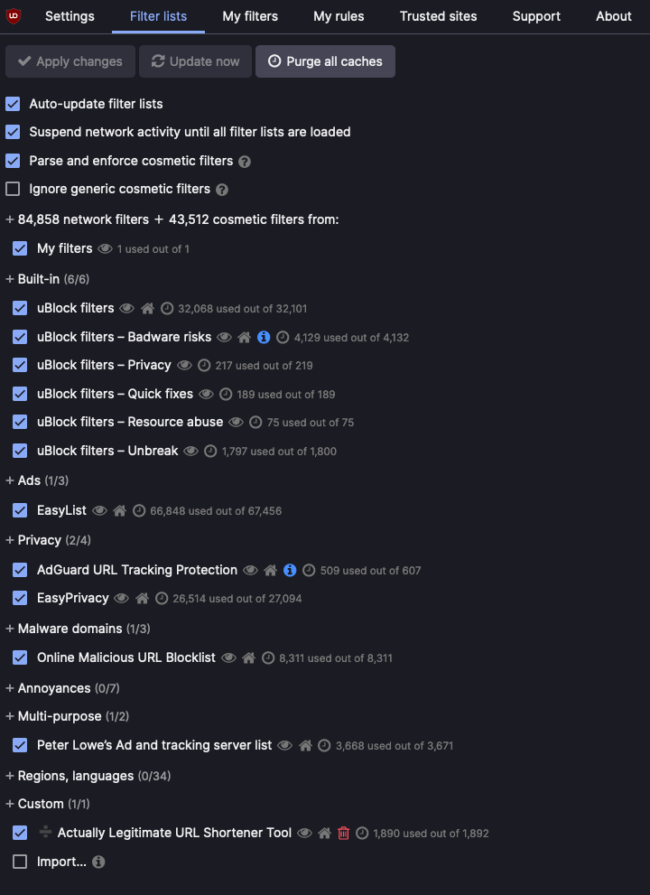
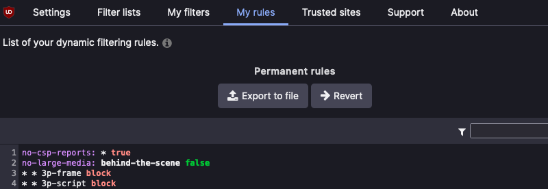

# Firefox Configuration
_This configuration aims to deliver the best privacy and security without breaking web sites._

**Note**: _Where directed to `enable` an option, the instruction should be taken as exclusive; i.e. if the option is one of several then all others should be disabled._

## Settings
- General
    - Disable `Recommend extensions as you browse`
    - Disable `Recommend features as you browse`
- Home
    - Firefox Home Content
        - Shortcuts
            - Disable `Sponsored shortcuts`
- Search
    - Search Suggestions
        - Disable all suggestions
- Privacy & Security
    - Select `Strict`
    - Select `Always` Send web sites a "Do Not Track" signal that you don’t want to be tracked
    - Cookies and Site Data
        - Enable `Delete cookies and site data when Firefox is closed`
    - Logins and Passwords
        - Disable `Ask to save logins and passwords for web sites`
    - History
        - Select Firefox will `Use custom settings for history`
        - Enable `Remember browsing and download history`
    - Permissions
        - Block all requests for all permissions
        - Enable `Block pop-up windows`
        - Enable `Warn you when web sites try to install add-ons`
    - Firefox Data Collection and Use
        - Disable all options
    - Security
        - Deceptive Content and Dangerous Software Protection
            - Enable `Block dangerous and deceptive content`
            - Enable `Block dangerous downloads`
            - Enable `Warn you about unwanted and uncommon software`
    - Certificates
        - Enable `Query OCSP responder servers to confirm the current validity of certificates`
    - HTTPS-Only Mode
        - Select `Enable HTTPS-Only Mode in all windows`

## about:config
- Set `extensions.pocket.enabled` to `false` to disable Pocket
- Set `dom.event.clipboardevents.enabled` to `false` to defeat copy/paste blocking

# Add-ons
- [Skip Redirect](https://addons.mozilla.org/en-US/firefox/addon/skip-redirect/)
- [FastForward](https://addons.mozilla.org/en-US/firefox/addon/fastforwardteam/)
- [Smart Referer](https://addons.mozilla.org/en-GB/firefox/addon/smart-referer/)
- [uBlock Origin](https://addons.mozilla.org/en-US/firefox/addon/ublock-origin/)

## Smart Referer Configuration
- Disable `Use default whitelist`
- Select `Lax` Domain name matching strictness

## uBlock Origin [Configuration](/firefox-config/ublock_origin_initial_config.txt)

    
Settings

    

    
Filter Lists

    

    
My Rules

    

 

# References
- [Arkenfox](https://github.com/arkenfox/user.js/wiki/4.1-Extensions)
- [Privacy Guides](https://www.privacyguides.org/browsers/#firefox)
